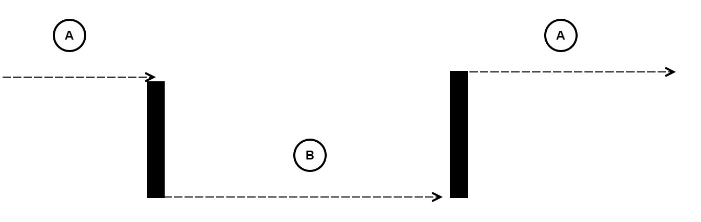
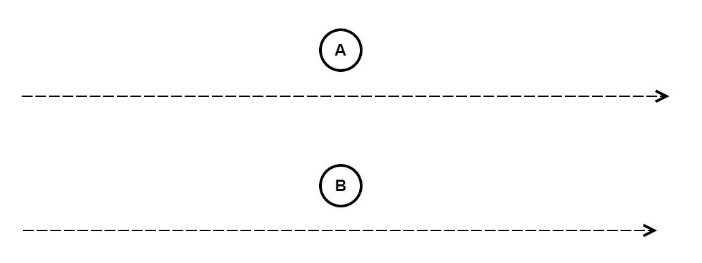

title: Akka.NET
subtitle: Reactive Programming in C#
class: segue dark nobackground

---

title: Akka.NET
subtitle: Reactive Programming
class: big
build_lists: true

Things we'll cover:

- Reactive Programming
- Quick Concepts Overview
- Akka.Net
- Actor System
- Messaging
- Referencing Actors
- Supervision and Monitoring
- Remoting
- Clustering
- Deployment

---

title: Reactive Programming
subtitle: What is it?
class: big

It is NOT:

- !Imperative Programming
- !Object-oriented Programming
- !Functional Programming

BUT:

- (Reactive & Object-oriented) 
- (Reactive & Functional) 
- (Reactive & Imperative)

---

title: Reactive Programming
subtitle: Four Characteristics from Reactive Manifesto
class: big
build_lists: true

- Responsive: Ability to respond in a timely manner if possible
- Resilient: Ability to handle failure and recover
- Elastic: Ability to scale under varying workloads
- Message Driven: Ability to asychronously communicate between components

<footer class="source">source: http://www.reactivemanifesto.org/</footer>

---

title: Reactive Programming
subtitle: Where does it come from?
class: big

- Stems from issues encountered in developing Distributed Systems
- Specically from synchronizing events in an ordered way across multiple processes 
- Can be traced back to a specific paper by Leslie Lamport [paper](assets/time-clocks.pdf)
- Expanded to include error handling, scaling and consistency
- Common example from wikipedia for Reactive Programming, sort of fails to illustate idea completely

<footer class="source">source: http://www.lamport.org/</footer>

---

title: Quick Concepts Overview
subtitle: Common Example from Wikipedia

<pre class="prettyprint" data-lang="javascript">
//NOT Reactive
var a = 2;
var b = 3;
var c = a + b;

a = 6
console.log(c); // prints/evaluates to 5, not 9

//REACTIVE
var c = function(){
    return a + b
}

console.log(c()); // prints/evaluates to 9
b = 7
console.log(c()); // prints/evaluates to 13
</pre>

---

title: Quick Concepts Overview
subtitle: Common Example IMPROVED

<pre class="prettyprint" data-lang="javascript">
//NOT Reactive
var a = 2; // event: init a then set a = 2 
var b = 3; // event: init b then set b = 3
var c = a + b; // event: init c then set c = eval(2 + 3)

a = 6 // event: update/set a = 6
console.log(c);  

//REACTIVE
var c = function(){ // event: update/set c = function(scope){ return eval: scope.a + scope.b }
    return a + b 
}

console.log(c()); // event: update/set c = eval(6 + 3)
b = 7
console.log(c()); // event: update/set c = eval(6 + 7)
</pre>

---

title: Quick Concepts Overview
subtitle: Ordering Events

How do we order events in a distributed system? 

Machine 1 ---------A---------->

Machine 2 ---------B---------->

Machine 3 ---------C---------->

Events: A, B, C happen on three different systems.

---

title: Quick Concepts Overview
subtitle: Total Ordering vs. Partial Ordering
content_class: flexbox vcenter

Total Ordering
===
- Events A, B, C all happen in the same sequence on each different machine.
- Expensive and typically only shows up in a single process system.

Partial Ordering
===
- Events A, B, C have a "happen's before" relationship that ensures dependency relationship.
- Often uses logical or vector clocks that establish a causal (happens before) relationship between events.

Happens Before (Causal Relationship)
===
- A happens before B and B happens before C therefore A happens before C. 
- A -> B -> C

---

title: Quick Concepts Overview
subtitle: Concurrency vs. Parallelism
content_class: flexbox vcenter

Concurrency
===
> Two or more threads/processes executing simulatenously but not necessarily at the same time.

---

title: Quick Concepts Overview
subtitle: Concurrency vs. Parallelism
content_class: flexbox vcenter

Parallelism
===
> Two or more threads/processes executing simulatenously at the same time.

---

title: Quick Concepts Overview
subtitle: Synchronous vs. Asynchronous

Synchronous
===
> Managing code blocks between two or more executing threads/processes.

Asynchronous
===
> Two or more threads/processes executing code blocks without need for synchronizing.

<pre class="prettyprint" data-lang="javascript">
//Async with jQuery AJAX
$.ajax({
  url: "foo.js",
  data: bar()
})
.done(function(data) {
  console.log(data);
})
.fail(function() {
    console.log("FAIL");
});
</pre>

---

title: Quick Concepts Overview
subtitle: Blocking vs. Non-blocking

Blocking
===
> One thread/process can possibly block (halt) the execution of another thread/process. 

Non-blocking
===
> One thread/process does not interfere with the execution of another thread/process. 

<pre class="prettyprint" data-lang="C#">
// Blocking
public class Foo{
    static void Main(string[] args){
        Thread t = new Thread(new Bar());
        t.Start();
        t.Join(); //Current Thread blocks until Thread t finishes
    }
}
</pre>

---

title: Quick Concepts Overview
subtitle: Deadlock vs. LiveLock
class: big

Deadlock
===
> A thread or process is blocked in a waiting (dead) state, usually waiting on a resource 

Livelock
===
> A thread or process is unblocked (doing other things) but still waiting on a resource to become available

<pre class="prettyprint" data-lang="C#">
// Livelock
public class Foo{
    private bool lock = true;
    static void Main(string[] args){
        Thread t = new Thread(new Bar());
        t.Start();
        while(lock){
            if(!t.IsAlive()){ lock = false; }
            else{ DoWork() } ;// Do work while we wait for t to finish
        }
    }
}
</pre>

---

title: Quick Concepts Overview
subtitle: Mutable vs. Immutable and State
class: big

Mutable
===
> Data that can change over it's lifespan

Immutable
===
> Data that remains unchanged over it's lifespan

State
===
> A unique configuration, usually as a snapshot in time 

<pre class="prettyprint" data-lang="c#">
class Foo{
    const int bar = 1; //Immutable
    int foobar = 1; //Mutable
}
class Program{
    void main(){
        var myFoo = new Foo(); //State snapshot myFoo(bar = 1, foobar = 1)
        myFoo.foobar = 3; //State snapshot myFoo(bar = 1, foobar = 3)
    }
}
</pre>

---

title: Akka.NET
subtitle: How does this fit?
class: big

Akka.NET

- is a System for building distributed systems with Reactive in mind
- ported from original Akka framework written for JVM (Java and Scala)
- targets/runs on .NET framework with C# or F#
- built with Distributed/Remote in mind first, not local -> remote  
- provides high-level abstration of distributed network and clustered environment
- Peer-to-Peer not traditional client-server model (supports Clustering with Symmetry)
- everything is done via Actors, messaging and is asynchonous by default

<footer class="source">source: http://getakka.net/</footer>

---

title: Actor System
subtitle: What are Actors?

- Actors are abstrations of behavior and state
- A bundle of code that sends and receives messages
- Does work based off events/messages
- Has a certain state at different times
- Asynchronous
- Underneath the Actor System allocates 1..N threads as needed (abstracts this away from the programmer)

<footer class="source">source: http://getakka.net/</footer>

---

title: Actor System
subtitle: Overview

<footer class="source">source: http://getakka.net/</footer>

---

title: Actor System
subtitle: GreetingInput Example

<pre class="prettyprint" data-lang="C#">
// An Actor extends the ReceiveActor 
public class GreetingActor : ReceiveActor {
    public GreetingActor(){
        Receive&lt;Greet&gt;(greet => Console.WriteLine("Hello {0}", greet.Who));
    }
}
// Or extends UntypedActor
public class GreetingActor : UntypedActor {
    protected override void OnReceive(Greet greet){
        Console.WriteLine("Hello {0}", greet.Who);
    }
}
// Or extends TypedActor and Implements IHandle &lt;Message&gt;
public class GreetingActor : TypedActor, IHandle &lt;Greet&gt; {
    void Handle(Greet greet){
        Console.WriteLine("Hello {0}", greet.Who);
    }
}
</pre>
---

title: Messaging
subtitle: Message Reliability in Akka

- Messages are sent asychronously
- Message ordering between two local actors is guaranteed in order
    - A1 sends M1 before M2 before M3 to A2
    - A2 receives M1 before M2 before M3 from A1
- This is because Messages are stored in a queue (mailbox) - first-in first-out
- Guaranteed at most once delivery (no guarantee of delivery)
- Failure is possible, messages can be lost, mis-sent, or actors might die 
- <b>Message ordering between two remote actors is not guaranteed in order due to network latency</b>

> "As a speculative view into the future it might be possible to support this ordering guarantee by re-implementing the remote transport layer based completely on actors."

---

title: Messaging
subtitle: PingPong Example

<pre class="prettyprint" data-lang="C#">
// Messages can be any type of object, like a class with a method
public class Ping {
    public string toString(){
        return "Ping!";
    }
}
// Or a class which has an immutable reference to another Actor instance
public class Start {
    public IActorRef Actor { get; private set; }
    public Start(IActorRef actor){
        Actor = actor;
    }
}
</pre>

---

title: Referencing Actors
subtitle: Actor System Hierarchy

---

title: Referencing Actors
subtitle: ActorLookup Example

- The system is composed of layers with referencing starting at:
    - Akka.tcp://system@host:port/ (Remote) 
    - Akka//system/ (local)
- The Top level is the user which acts as guardian/supervisor of the entire system 
    - So always a way to get back to top level from any actor

<pre class="prettyprint" data-lang="C#">
// We can lookup actors via the ActorSelection() method
Context.ActorSelection("/user/" + query.Name).Tell(new Hello());

// Or we can use an IActorRef to send a message to an actor directly.
IActorRef actorlookup = system.ActorOf<ActorLookup>("actorlookup");
actorlookup.Tell(new Query(input));
</pre>

---

title: Referencing Actors
subtitle: DeadLetters

- DeadLetters is a system (synthetic) actor created by Akka for messages that can't be delievered
- /deadLetters is not a guaranteed delivery mechanism
- If any undeliverable messages that the system is aware of, deadLetters will show up
- Many used as a debugging mechanism, not as a production fall back

---

title: Supervision and Monitoring
subtitle: Stages of Life for an Actor

- every actor has 5 stages of life 
    - 1) Starting 
    - 2) Receiving
    - 3) Stopping
    - 4) Terminated
    - 5) Restarting

- every actor has hook methods to define code
    - preStart() - gets run before Receiving
    - preRestart() - gets run before Restarting
    - postStop() - gets run after Stopping and before Restarting
    - postRestart() - gets run after Restarting and before Start

---

title: Supervision and Monitoring
subtitle: Lifecycle of an Actor

---

title: Supervision and Monitoring
subtitle: DeathWatch Example

- Monitoring behavior is defined through a SupervisorStrategy
    - OneForOneStrategy - deals with only the failing child
    - AllForOneStrategy - deals with sibilings of failing child as well

<pre class="prettyprint" data-lang="C#">
// Easiest way is to setup a supervisor strategy for children
protected override SupervisorStrategy SupervisorStrategy(){
    return new OneForOneStrategy(x => { return Directive.Stop; });
}
// Actors can also signup to watch other actors
Context.Watch(actor);
// And can stop children if need be
Context.Stop(child);
</pre>

---

title: Remoting
subtitle: Configuration

- Configuration in Akka uses the HOCON (Human-Optimized Config Object Notation) format
- It is a superset of JSON with key value pairs. 

<pre class="prettyprint" data-lang="HOCON">
akka {
	loglevel = DEBUG
    actor {
        provider = ""Akka.Remote.RemoteActorRefProvider, Akka.remote""
    }
    remote {
		helios.tcp {
			transport-class = ""Akka.Remote.Transport.Helios.HeliosTcpTransport, Akka.Remote""
			transport-protocol = tcp
            port = 8090
            hostname = localhost
		}
    }
}
</pre>

---

title: Remoting
subtitle: Actor Lookup Distributed Example

- Akka.Remote uses Helios
    - a middleware framework for .NET which provides access to transport protocols like TCP and UDP 

<pre class="prettyprint" data-lang="C#">
// After configure the remote protocol, port, host and provider
// we can call the actor remotely via the path
system.ActorSelection("akka.tcp://MyServer@localhost:8080/user/");
// Or we could configure this in the config and use a router to call it
akka.actor.deployment {
  /remoteactor {
    router = round-robin-pool
    nr-of-instances = 5
    remote = ""akka.tcp://MyServer@localhost:8080""
  }
}
var remote = system.ActorOf(Props.Create(() => new SomeActor(null, 123))
    .WithRouter(FromConfig.Instance), "remoteactor");
</pre>

---

title: Clustering
subtitle: Different Types of Clustering

- Clustering uses parallelization to split work up across many actors/nodes
- Multiple different ways to create clusters 
    - Routers and Actor Pools like RoundRobinPool, RandomPool or ConsistentHashingPool
    - Akka.Cluster namespace - provides publish/subscribe behavior, leader election, and much more 
    - Other Custom implementations
- Actor hierarchy and routers makes clustering much more managable
- Can integrate nodes with other tech like SignalR, SQL Server, ASP.NET MVC

---

title: Clustering
subtitle: MapReduce Example

<pre class="prettyprint" data-lang="C#">
// We can create pools of actors using the RoundRobinPool
system.ActorOf(new RoundRobinPool(5, null, null, null, usePoolDispatcher: false).Props(Props.Create<ReduceActor>(5)));
// Or we can create our own as a list using the hashed index as the router
var reduceActors = new List<IActorRef>();
for (int i = 0; i < 10; i++)
{
    reduceActors.Add(system.ActorOf(Props.Create<ReduceActor>(1)));
}
// Or we could use the Akka.Cluster.Cluster class
Akka.Cluster.Cluster Cluster = Akka.Cluster.Cluster.Get(Context.System);
// And subscribe to events
Cluster.Subscribe(Self, ClusterEvent.InitialStateAsEvents, new []{ typeof(ClusterEvent.IMemberEvent), typeof(ClusterEvent.UnreachableMember) });
</pre>

---

title: Deployment
subtitle: Deployment Options (More Info on Doc Website)

- Console Application

- ASP.NET

- Windows Service using TopShelf

- Azure

---

title: Akka.NET vs. TPL Dataflow or Async/Await
subtitle: When to consider Akka.NET

When you need
===
- to communicate between two remote systems in an asynchonous manner
- expect failures and need to monitor (supervise) work
- stateful components capable of updating state based off events from another component
- clustering with a master-slave configuration (supervisor-> many workers)
- really anything that is going to use a lot of interprocess communication

When to consider others: TPL Dataflow or Async/Await
===
- basically anything that is not going to be distributed
- need asyc functionality but not in a distributed manner
- need high degree of parallelism but not in a distributed manner
- need message passing functionality but not in a distributed manner

---

title: Akka.NET and kCura
subtitle: Thoughts on integrating Akka.NET

- Communication between Applications hosted in Relativity
- Agents as Actors, communicating with each other instead of being locked into a container
- Communication between Relativity and Invariant or Worker Manager Server and Workers
- Procuro as an Actor, send it messages about what scripts to run, version, etc.
- And more...

---

title: Things Not Covered
subtitle: But Still Relevant for further investigation

- Persistence
- I/O
- Serialization
- Publisher/Subscriber with EventBus
- Logging
- Scheduler
- Preventing Cascading Failures with Circuit Breaker
- Dispatchers
- Dependency Injection
- Stashing Messages
- Switching State/Behavior
- Akka.NET with F#

---