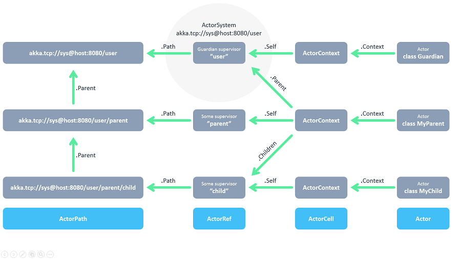

title: Akka.Net
subtitle: Reactive Programming in C#
class: segue dark nobackground

---

title: Akka.Net
subtitle: Reactive Programming
class: big
build_lists: true

Things we'll cover:

- Reactive Programming
- Quick Concepts Overview
- Akka.Net
- Actor System
- Messaging
- Referencing Actors
- Supervision and Monitoring
- Persistence
- Publisher/Subscriber
- Deployment

---

title: Reactive Programming
subtitle: What is it?
class: big

It is NOT:

- !Imperative Programming
- !Object-oriented Programming
- !Functional Programming

BUT:

- (Reactive & Object-oriented) 
- (Reactive & Functional) 
- (Reactive & Imperative)

---

title: Reactive Programming
subtitle: Four Characteristics from Reactive Manifesto
class: big
build_lists: true

- Responsive: Ability to respond in a timely manner if possible
- Resilient: Ability to handle failure and recover
- Elastic: Ability to scale under varying workloads
- Message Driven: Ability to asychronously communicate between components

<footer class="source">source: http://www.reactivemanifesto.org/</footer>

---

title: Reactive Programming
subtitle: Where does it come from?
class: big

- Stems from issues encountered in developing Distributed Systems
- Specically from synchronizing events in an ordered way across multiple processes 
- Can be traced back to a specific paper by Leslie Lamport [paper](assets/time-clocks.pdf)
- Expanded to include error handling, scaling and consistency
- Common example from wikipedia for Reactive Programming, sort of fails to illustate idea completely
- So I tried to improve it a little bit.

<footer class="source">source: http://www.lamport.org/</footer>

---

title: Quick Concepts Overview
subtitle: Common Example from Wikipedia

<pre class="prettyprint" data-lang="javascript">
//NOT Reactive
var a = 2;
var b = 3;
var c = a + b;

a = 6
console.log(c); // prints/evaluates to 5, not 9

//REACTIVE
var c = function(){
    return a + b
}

console.log(c()); // prints/evaluates to 9
b = 7
console.log(c()); // prints/evaluates to 13
</pre>

---

title: Quick Concepts Overview
subtitle: Common Example IMPROVED

<pre class="prettyprint" data-lang="javascript">
//NOT Reactive
var a = 2; // event: init a then set a = 2 
var b = 3; // event: init b then set b = 3
var c = a + b; // event: init c then set c = eval(2 + 3)

a = 6 // event: update/set a = 6
console.log(c);  

//REACTIVE
var c = function(){ // event: update/set c = function(scope){ return eval: scope.a + scope.b }
    return a + b 
}

console.log(c()); // event: update/set c = eval(6 + 3)
b = 7
console.log(c()); // event: update/set c = eval(6 + 7)
</pre>

---

title: Quick Concepts Overview
subtitle: Ordering Events

How do we order events in a distributed system? 

Machine 1. ---------------

Machine 2. ---------------

Machine 3. ---------------

Totally Ordered: Events A, B, C all happen in the same sequence on each different machine.

Partially Ordered: Events A, B, C have a "happen's before" relationship that ensures dependency relationship.

> A happens before B and B happens before C therefore A happens before C. 

Total Ordering is expensive and typically only show up in a single process system.

Partial Ordering can be achieved with the use of logical or vector clocks that establish a casual relationship between events.

---

title: Quick Concepts Overview
subtitle: Concurrency vs. Parallelism

Concurrency
===
> Two or more threads/processes are executing simulatenously, but not necessarily at the same time.

> A------|_________---------

> B      >--------|_________

Parallelism
===
> Two or more threads/processes are executing simulatenously at the same time.

> A -----------------

> B -----------------

---

title: Quick Concepts Overview
subtitle: Synchronous vs. Asynchronous, Blocking vs. Non-blocking

Blocking/Synchronous
===
> The thread/process makes a call or request then stop's execution until the request returns.

Non-blocking/Asynchronous
===
> The thread/process makes a call or request then continue's execution and possibly handles the return request at a later time.

<pre class="prettyprint" data-lang="javascript">
//Blocking
function test(){
    var tester = test2(); // blocks until the test2 method returns the value
    console.log(tester);
}

function test2(){
    var count = 0;
    for(var x = 0; x < 100; x++){
        count += 1;
    }
    return count;
}

//Non-Blocking
$.ajax({
  url: "test2()",
  data: tester
})
.done(function() {
  console.log(tester);
})
.fail(function() {
    console.log("FAIL");
});
</pre>

---

title: Quick Concepts Overview
subtitle: Deadlock, LiveLock, Starvation
class: big
build_lists: true

Deadlock: 

Livelock: 

Starvation: 

---

title: Quick Concepts Overview
subtitle: Mutable vs. Immutable and State
class: big
build_lists: true

Mutable:

Immutable:

State:

---

title: Akka.Net
subtitle: How does this fit?
class: big

Akka.Net

- is a System for building distributed systems with Reactive in mind
- ported from original Akka framework written for JVM (Java and Scala)
- targets/runs on .Net framework with C# or F#
- built with Distributed/Remote in mind first, not local -> remote  
- provides high-level abstration of distributed network and clustered environment
- Peer-to-Peer not traditional client-server model (supports Clustering with Symmetry)
- everything is done via Actors, messaging and is asynchonous by default

<footer class="source">source: http://getakka.net/</footer>

---

title: Actor System
subtitle: Overview

Actors

- 

<footer class="source">source: http://getakka.net/</footer>

---

title: Actor System
subtitle: Hello World Example

<pre class="prettyprint" data-lang="csharp">
// Class Greet - is the Immutable Message that we pass.
public class Greet
{
    public Greet(string who){
        Who = who;
    }
    public string Who { get; private set; }
}
// Class GreetingActor extends the ReceiveActor 
// and handles what happens when the message is passed to it 
public class GreetingActor : ReceiveActor
{
    public GreetingActor(){
        Receive<Greet>(greet => Console.WriteLine("Hello {0}", greet.Who));
    }
}
// Our Program creates an Actor System which handles sending the messages to the actors
// Not necessary though, Actors can talk to other Actors
public class Program
{
    public void Main(string[] args)
    {
        var system = ActorSystem.Create("MySystem");
            
        var greeter = system.ActorOf<GreetingActor>("greeter");
            
        greeter.Tell(new Greet("World!"));
    }
}
</pre>
---

title: Messaging
subtitle: PingPong Example

<pre class="prettyprint" data-lang="csharp">
// Messages can be any type of object, like a class with a method
public class Ping
{
    public string toString(){
        return "Ping!";
    }
}
// Or a class which has an immutable reference to another Actor instance
public class Start
{
    public IActorRef Actor { get; private set; }
    public Start(IActorRef actor){
        Actor = actor;
    }
}
</pre>
---

title: Referencing Actors
subtitle: Actor System Heirarchy

---

